<!-- Banner/Splash -->

    
 
    	   
      <h2>Turn your databases into a single API with Quarry.</h2>
       
      

      <a href="./get-started" class="button success "><strong>GET STARTED</strong></a>
      

    

    

      
      

        <iframe width="470px" height="270px" src="img/quarry.gif" frameborder="0" class = "hide-for-small"></iframe>
      

    

  
 
  

  <ul class="accordion hide-for-medium-up" data-accordion="" role="tablist">
  <li class="accordion-navigation">
    <a aria-expanded="true" href="#panel1d" role="tab" id="panel1d-heading" aria-controls="panel1d">Overview</a>
    

			<h3 class = "text-left"><strong>FREE</strong></h3>
			
Without any strings attached. It's yours to try and use today!

			<h3 class= "text-left"><strong>SECURE</strong></h3>
			

			Built with NIST standards in
			mind. It's great for any federal,
			state or local organization that 
			needs to share publicly available
			data through an API.
			

			<h3 class= "text-left"><strong>SUPPORTED</strong></h3>
			
We regularly provide updates and are here to help you.
			
      

  </li>
  <li class="accordion-navigation">
    <a aria-expanded="false" href="#panel2d" role="tab" id="panel2d-heading" aria-controls="panel2d">Features</a>
    

		<h2><strong>Database Support</strong></h2>
			
PostSQL - Version x or later

			
DB2 - Version 5.2 or later

			
Oracle - Version 9i or later

			
MySQL - Version 4 or later

			
MSSQL - Version 2010 or later

		<h2><strong>Protect Your Data</strong></h2>
	  
 Delegation - Give access to local database administrators to control what data is shared 

	  
 Obfuscation - Make your table names human-friendly by hiding the technical details 

    <h2><strong>Ease of Use</strong></h2>
	  <h3>For Administrators</h3>
		
Administrative interface with forms-based interface for managing:

			
Datasets

			
API users

			
Developer keys
	
		<h3>For Developers</h3>
		

		  One stop shop for your organization's datasets
		  One API key works across all of your datasets
		  Software development kits for 8 languages & platforms
		
    
	

  </li>
  <li class="accordion-navigation ">
    <a aria-expanded="false" href="#panel3d" role="tab" id="panel3d-heading" aria-controls="panel3d">Requirements</a>
    

	  
<strong>To run Quarry you’ll need:</strong>

       
A Debian based Linux distribution that has at least 5 GB of memory, two 2 gigabyte processors, and 20 gigabytes of free space.

        
Access to a MySQL or Microsoft SQL server.

        
Ability to download the <a href="
http://www.rackspace.com/knowledge_center/article/install-epel-and-additional-repositories-on-centos-and-red-hat
">REMI</a> and <a href=" 
http://www.rackspace.com/knowledge_center/article/install-epel-and-additional-repositories-on-centos-and-red-hat
">EPEL</a>  repositories.

  	
	   <a href="https://github.com/USDepartmentofLabor/Quarry" class="button"><strong>Download Quarry</strong></a>	      

  </li>
    <li class="accordion-navigation ">
    <a aria-expanded="false" href="#panel4d" role="tab" id="panel4d-heading" aria-controls="panel4d">Documentation</a>
    

 <section role="tabpanel" aria-hidden="true" data-options="deep_linking:true; scroll_to_content: true" class="content panel documentation radius" id="panel2-4">
		

			<!-- HIDE FOR NOW
			<ul>
				<li><a href="#Quarry_API_User_Manual">Quarry API User Manual</a></li>
				<li><a href="#Overview">Overview</a></li>
				<li><a href="#Product_Information">Product Information</a></li>			
				<li><a href="#Product_Features">Product Features</a></li>
				<li><a href="#User_Types">User Types</a></li>
				<li><a href="#User_Type_Hierarchical_Details">User Type Hierarchical Details</a></li>
				<li><a href="#Super_Administrators">Super Administrators</a></li>
				<li><a href="#Application_Managers">Application Managers</a></li>
				<li><a href="#Developers">Developers</a></li>
				<li><a href="#Consumers">Consumers</a></li>
				<li><a href="#User_Management">User Management</a></li>
				<li><a href="#User_Lifecycle_Flow">User Lifecycle Flow</a></li>
				<li><a href="#User_Policies">User Policies</a></li>
				<li><a href="#Permissions">Permissions</a></li>
				<li><a href="#Roles">Roles</a></li>
				<li><a href="#Quarry_API_Key_Management">Quarry API Key Management</a></li>
				<li><a href="#Creating_Quarry_API_Keys">Creating Quarry API Keys</a></li>
				<li><a href="#Quarry_API_Keys">Quarry API Keys</a></li>
				<li><a href="#Dataset_Service_Managemen">Dataset Service Management</a></li>
				<li><a href="#Supported_Database_Types">Supported Database Types</a></li>
				<li><a href="#Typical_Configuration_Sequence_of_Quarry_API_Data_Service">Typical Configuration Sequence of Quarry API Data Service</a></li>
				<li><a href="#Add_Data_Service">Add Data Service</a></li>
			</ul>
			-->
			<h1 id="Quarry_API_User_Manual">Quarry API User Manual</h1>
			 
			<h2 id="Overview">Overview</h2>
			
This document is an operational overview of the administrative interface for Quarry API.  Details will be provided on how to manage and publish datasets.

			<h3 id = "Product_Information">Product Information</h3>
			
Quarry API is a convenient way to access DOL data and is designed using RESTful technology along with the user-friendly web 2.0 accessible layout. Therefore, the burden of data configuration, user management and RESTful API calls can be done with a less technically skilled staff.

			<h3 id="Product_Features">Product Features</h3>
			
With Quarry API you can:

			<ul>
				<li>Use any open web language to access data</li>
				<li>Obtain public datasets in JSON or XML formats</li>
				<li>Filter RESTful queries by key/pair parameters</li>
				<li>Run API CRUD (Create, Read, Update, and Delete) operations</li>
				<li>Conduct transactions via mobile device</li>
				<li>Add, edit, and delete users</li>
				<li>Add, edit, and delete user roles and permissions</li>
				<li>Add, edit, and delete Quarry API keys</li>
				<li>Add, edit, delete, and test data sources for DOL dataset retrieval</li>
			</ul>
			<h2 id="User_Types">User Types</h2>
			

				<table summary="Quarry API User Roles, which contains user type, definition, and technical proficiency fields">
					<caption>Quarry API User Roles</caption>
					<thead>
						<tr>
							<th scope="col">User Type</th>
							<th scope="col">Definition</th>
							<th scope="col">Technical Proficiency</th>
						</tr>
					</thead>
					<tbody>
						<tr>
							<th scope="row">Super Administrators (<b>Highest category</b>)</th>
							<td>Performs user and API management</td>
							<td>LOW</td>
						</tr>
						<tr>
							<th scope="row">Application Managers</th>
							<td>Manages how data is configured and propagated</td>
							<td>MID</td>
						</tr>
						<tr>
							<th scope="row">Developers</th>
							<td>Maintains the interface and writes applications</td>
							<td>HIGH</td>
						</tr>
						<tr>
							<th scope="row">Consumers</th>
							<td>End users</td>
							<td>LOW</td>
						</tr>
					</tbody>
				</table>
			

			

				<h3 id="Quarry_API_User_Roles">Quarry API User Roles</h3>
				

					
User Type: Super Administrators (<b>Highest category</b>)

					
Definition Performs user and API management

					
Technical Proficiency: LOW

				

				

					
User Type: Application Managers

					
Definition: Manages how data is configured and propagated

					
Technical Proficiency: MID

				

				

					
User Type: Developers

					
Definition Maintains the interface and writes applications

					
Technical Proficiency: HIGH

				

				

					
User Type: Consumers

					
Definition: End users

					
Technical Proficiency: LOW

				

			

			<h2 id="User_Type_Hierarchical_Details">User Type Hierarchical Details</h2>
			
This section describes how Quarry user types are defined and their contribution to the overall API data lifecycle.
			
			<h3 id="Super_Administrators">Super Administrators</h3>			
			
Administrators are the highest type of users in Quarry. They have access to all rights and features in the system. Their primary roles are to manage users, generate API keys for users, assign roles to all new users, and monitor the overall system health.

			<h3 id="Application_Managers">Application Managers</h3>
			
Users who only need to create datasets will be given this role. The application manager manages the data source&rsquo;s external system and will have the configuration details to create a connection for remote access to the necessary data. The application manager will need a valid API key to test a connection, along with test and examine the dataset prior to giving developers public access.

			<h3 id="Developers">Developers</h3>
			
Developers can be users who maintain Quarry API&rsquo;s codebase or are responsible for creating end user applications. Developers generally will use Quarry API to populate their applications.

			<h3 id="Consumers">Consumers</h3>
			
End users will be able to consume Quarry API data via handheld, tablet and desktop.

			<h2 id="User_Management">User Management</h2>
			<h3 id="User_Lifecycle_Flow">User Lifecycle Flow</h3>
			
All Quarry API users will need to register. Below is the Quarry API registration screen.

			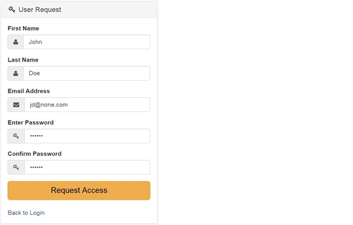
			<h4>Get Approved by an Administrator</h4>
			
An administrator will see your registration in the Pending Request page and will begin the approval process.

			<h5>Pending User Account Request List</h5>
			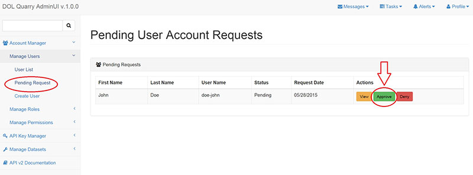
			<h5>Approve Pending User Account Request</h5>
			
The pending page allows administrators to select your role and modify other information in your profile. This user has been given <b>Super Admin</b> rights.

			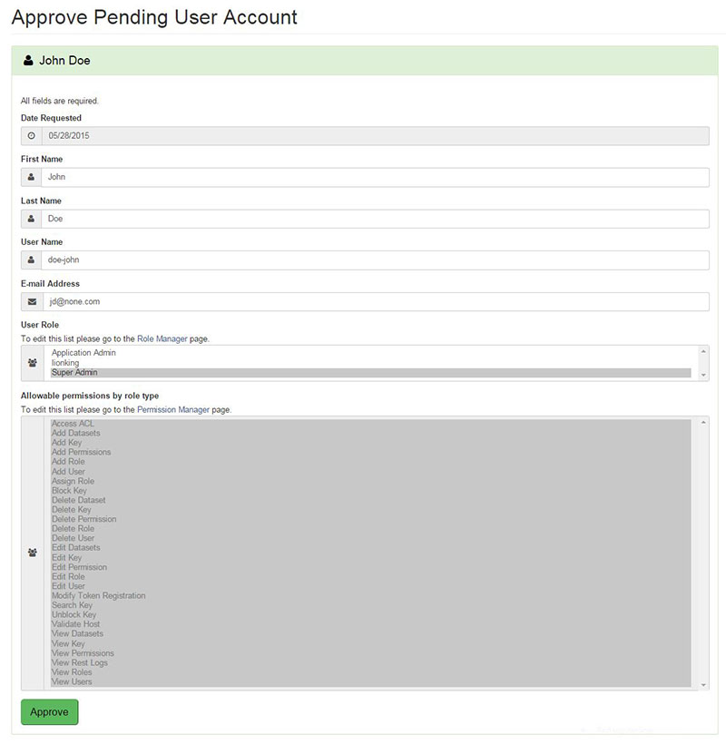
			<h5>User Account Approval Message</h5>
			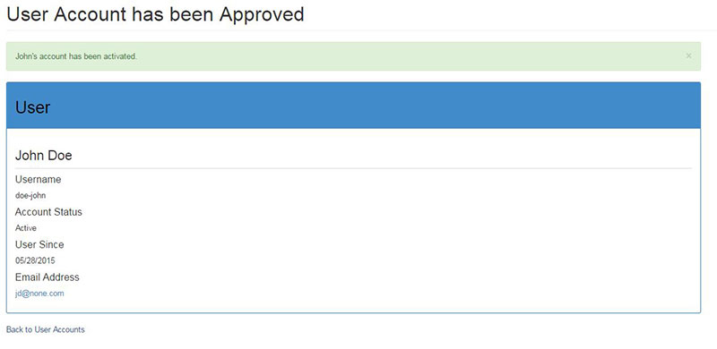			
			<h5>Login Screen</h5>
			
<b>Note</b>: Request Access feature has not been implemented as of v.1.0.0
			
			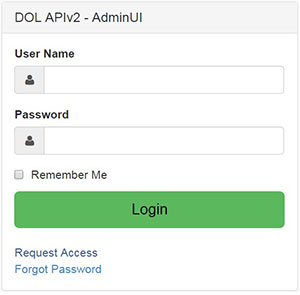			
			<h5>User Password Reset</h5>
			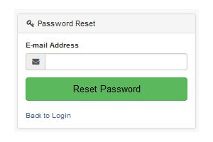
			<h2 id="User_Policies">User Policies</h2>
			<h3 id="Permissions">Permissions</h3>
			
AdminUI is a permission-based interface which represents user driven features. All actions and operations are assigned to a permission in the source code. However, a permission must be created in the interface prior to the action being programmed in the source code. The Access Control List (ACL) governs permission&rsquo;s management in the AdminUI system. You can assign permissions to roles in the <b>Role Manager</b> page.

			<h4>Access Control List (ACL)</h4>			
			

				<table summary="Quarry Access Control List (ACL), which contains API permissions and description fields">
					<caption>Quarry Access Control List (ACL)</caption>
					<thead>
						<tr>
							<th scope="col">Quarry API Permissions</th>
							<th scope="col">Feature/Operation</th>
						</tr>
					</thead>
					<tbody>
						<tr>
							<td>Access ACL</td>
							<td>Allows access to view, and change settings in the ACL</td>
						</tr>
						<tr>
							<td>Add Datasets</td>
							<td>User can add datasets</td>
						</tr>
						<tr>
							<td>Add Key</td>
							<td>Generate new API keys</td>
						</tr>
						<tr>
							<td>Add Permissions</td>
							<td>Add permissions to the system</td>
						</tr>
						<tr>
							<td>Add Role</td>
							<td>Create new roles</td>
						</tr>
						<tr>
							<td>Add User</td>
							<td>Allows user to add roles to the system</td>
						</tr>
						<tr>
							<td>Assign Role</td>
							<td>Can assign roles to users</td>
						</tr>
						<tr>
							<td>Block Key</td>
							<td>Block API keys from interacting with Quarry</td>
						</tr>
						<tr>
							<td>Delete Dataset</td>
							<td>Delete datasets</td>
						</tr>
						<tr>
							<td>Delete Key</td>
							<td>Delete API keys</td>
						</tr>
						<tr>
							<td>Delete Permission</td>
							<td>Delete permissions from the system</td>
						</tr>
						<tr>
							<td>Delete Role</td>
							<td>Delete roles from the system</td>
						</tr>
						<tr>
							<td>Delete User</td>
							<td>Delete a user from the system</td>
						</tr>
						<tr>
							<td>Edit Datasets</td>
							<td>Edit datasets</td>
						</tr>
						<tr>
							<td>Edit Key</td>
							<td>Edit API key parameters </td>
						</tr>
						<tr>
							<td>Edit Permission</td>
							<td>Edit permission</td>
						</tr>
						<tr>
							<td>Edit Role</td>
							<td>Edit role properties</td>
						</tr>
						<tr>
							<td>Edit User</td>
							<td>Edit user profiles</td>
						</tr>
						<tr>
							<td>Modify Key Registration</td>
							<td>Edit registered API key</td>
						</tr>
						<tr>
							<td>Search Key</td>
							<td>Search API keys by properties</td>
						</tr>
						<tr>
							<td>Unblock Key</td>
							<td>Unblock an API key</td>
						</tr>
						<tr>
							<td>Validate Host</td>
							<td>Allowed to validate a data source connection</td>
						</tr>
						<tr>
							<td>View Datasets</td>
							<td>View datasets</td>
						</tr>
						<tr>
							<td>View Key</td>
							<td>View API keys</td>
						</tr>
						<tr>
							<td>View Permissions</td>
							<td>View permissions list</td>
						</tr>
						<tr>
							<td>View Rest Logs</td>
							<td>View REST transactions log</td>
						</tr>
						<tr>
							<td>View Roles</td>
							<td>View user role list</td>
						</tr>
						<tr>
							<td>View Users</td>
							<td>View user account list</td>
						</tr>
					</tbody>
				</table>
			
			
			

				<h5>Quarry Access Control List (ACL)</h5>
				

					
Quarry API Permissions: Access ACL

					
Feature/Operation: Allows access to view, and change settings in the ACL

				

				

					
Quarry API Permissions: Add Datasets

					
Feature/Operation: User can add datasets

				

				

					
Quarry API Permissions: Add Key

					
Feature/Operation: Generate new API keys

				

				

					
Quarry API Permissions: Add Permissions

					
Feature/Operation: Add permissions to the system

				

				

					
Quarry API Permissions: Add Role

					
Feature/Operation: Create new roles

				

				

					
Quarry API Permissions: Add User

					
Feature/Operation: Allows user to add roles to the system

				

				

					
Quarry API Permissions: Assign Role

					
Feature/Operation: Can assign roles to users

				

				

					
Quarry API Permissions: Block Key

					
Feature/Operation: Block API keys from interacting with Quarry

				

				

					
Quarry API Permissions: Delete Dataset

					
Feature/Operation: Delete datasets

				

				

					
Quarry API Permissions: Delete Key

					
Feature/Operation: Delete API keys

				

				

					
Quarry API Permissions: Delete Permission

					
Feature/Operation: Delete permissions from the system

				

				

					
Quarry API Permissions: Delete Role

					
Feature/Operation: Delete roles from the system

				

				

					
Quarry API Permissions: Delete User

					
Feature/Operation: Delete a user from the system

				

				

					
Quarry API Permissions: Edit Datasets

					
Feature/Operation: Edit datasets

				

				

					
Quarry API Permissions: Edit Key

					
Feature/Operation: Edit API key parameters

				

				

					
Quarry API Permissions: Edit Permission

					
Feature/Operation: Edit permission

				

				

					
Quarry API Permissions: Edit Role

					
Feature/Operation: Edit role properties

				

				

					
Quarry API Permissions: Edit User

					
Feature/Operation: Edit user profiles

				

				

					
Quarry API Permissions: Modify Key Registration

					
Feature/Operation: Edit registered API key

				

				

					
Quarry API Permissions: Search Key

					
Feature/Operation: Search API keys by properties

				

				

					
Quarry API Permissions: Unblock Key

					
Feature/Operation: Unblock an API key

				

				

					
Quarry API Permissions: Validate Host

					
Feature/Operation: Allowed to validate a data source connection

				

				

					
Quarry API Permissions: View Datasets

					
Feature/Operation: View datasets

				

				

					
Quarry API Permissions: View Key

					
Feature/Operation: View API keys

				

				

					
Quarry API Permissions: View Permissions

					
Feature/Operation: View permissions list

				

				

					
Quarry API Permissions: View Rest Logs

					
Feature/Operation: View REST transactions log

				

				

					
Quarry API Permissions: View Roles

					
Feature/Operation: View user role list

				

				

					
Quarry API Permissions: View Users

					
Feature/Operation: View user account list

				

			
			
			<h4>Adding Permissions</h4>
			
Adding permissions is a straightforward process. Please make sure you <b>do not</b> create duplicate system IDs or system names.

			

				<table summary="Quarry Permissions, which about property and definition fields">
					<caption>Quarry Permissions</caption>
					<thead>
						<tr>
							<th scope="col">Property</th>
							<th scope="col">Definition</th>
						</tr>
					</thead>
					<tbody>
						<tr>
							<td>System Name</td>
							<td>Human readable name for a permission</td>
						</tr>
						<tr>
							<td>System ID</td>
							<td>Slug name that is used in the source code</td>
						</tr>
						<tr>
							<td>Description</td>
							<td>Description of the permission</td>
						</tr>
					</tbody>
				</table>
			

			

				<h5>Quarry Permissions</h5>
				

					
Property: System Name

					
Definition: Human readable name for a permission

				

				

					
Property: System ID

					
Definition: Slug name that is used in the source code

				

				

					
Property: Description

					
Definition: Description of the permission

				

			

			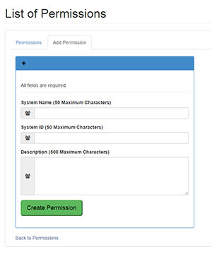
			<h3 id="Roles">Roles</h3>
			
All users must be assigned a role, which is a set of permissions that grants users access to AdminUI features.

			

				<table summary="Quarry Roles, which are the suer type and their permissions">
					<caption>Quarry Roles</caption>
					<thead>
						<tr>
							<th scope="col">User Type</th>
							<th scope="col">Rights</th>
						</tr>
					</thead>
					<tbody>
						<tr>
							<td>Super Administrators</td>
							<td>All permissions</td>
						</tr>
						<tr>
							<td>Application Managers</td>
							<td>Permissions only related to dataset management</td>
						</tr>
					</tbody>
				</table>
			

			

				<h4>Quarry Roles</h4>
				

					
User Type: Super Administrators

					
Rights: All permissions

				

				

					
User Type: Application Managers

					
Rights: Permissions only related to dataset management

				

			
			
			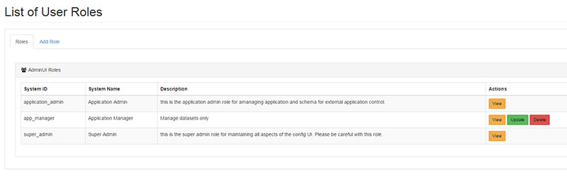
			
You can create roles in the Account Manager menu. A role must be assigned at least one permission during its creation.  The table below describes the required role parameters.

			

				<table summary="List of User Roles, which a person can view, update, or delete">
					<caption>List of User Roles</caption>
					<thead>
						<tr>
							<th scope="col">Property</th>
							<th scope="col">Definition</th>
						</tr>
					</thead>
					<tbody>
						<tr>
							<td>System Name</td>
							<td>Human readable name</td>
						</tr>
						<tr>
							<td>System ID</td>
							<td>Slug name that is used in the source code</td>
						</tr>
						<tr>
							<td>Description</td>
							<td>Description of the role</td>
						</tr>
						<tr>
							<td>Permissions</td>
							<td>You can assign permissions in the UI</td>
						</tr>
					</tbody>
				</table>
			

			

				<h4>List of User Roles</h4>
				

					
Property: System Name

					
Definition: Human readable name

				

				

					
Property: System ID

					
Definition: Slug name that is used in the source code

				

				

					
Property: Description

					
Definition: Description of the role

				

				

					
Property: Permissions

					
Definition: You can assign permissions in the UI

				

			

			<h4>Creating Roles</h4>
			
Permissions will vary based on the user role, which you cannot have duplicate system IDs or system names.

			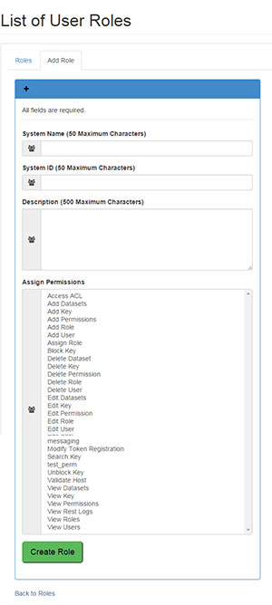
			<h2 id="Quarry_API_Key_Management">Quarry API Key Management</h2>
			<h3 id="Creating_Quarry_API_Keys">Creating Quarry API Keys</h3>
			
Administrators can create new API keys by using the <b>Register New Key</b> tab found under the <b>API Key Manager</b> menu. Quarry API will accept APIv1 keys as well. A user can own multiple Quarry API keys. New API keys are emailed to the user.

			

				<table summary="Quarry API Key Information, which uses API key name, e-mail address, and description">
					<caption>OSHA Violation General Duty Standards</caption>
					<thead>
						<tr>
							<th scope="col">API Key Property</th>
							<th scope="col">Definition</th>
						</tr>
					</thead>
					<tbody>
						<tr>
							<td>API key name</td>
							<td>API label given by the user or organization</td>
						</tr>
						<tr>
							<td>Assigned E-mail Address</td>
							<td>User&rsquo;s email address</td>
						</tr>
						<tr>
							<td>Description</td>
							<td>API key description</td>
						</tr>
					</tbody>
				</table>
			

			

				<h4>Quarry API Key Information</h4>
				

					
API Key Property: API key name

					
Definition: API label given by the user or organization

				

				

					
API Key Property: Assigned E-mail Address

					
Definition: User&rsquo;s email address

				

				

					
API Key Property: Description

					
Definition: API key description

				

			
			
			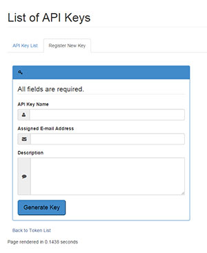
			<h3 id="Quarry_API_Keys">Quarry API Keys</h3>
			
The <b>API Key Manager</b> contains a list of API keys. In addition to deleting keys, administrators can block/unblock user keys should the need arises, along with additional features available on this page.

			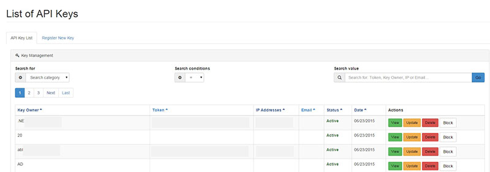
			<h2 id="Dataset_Service_Managemen">Dataset Service Management</h2>
			
The <b>Manage Datasets</b> menu allows administrators to configure datasets for the Quarry API REST engine. The definitions in table 6.1 are the main components for the dataset management service.  The connection string parameters are supplied by the data source owner.

			
Be mindful that Quarry API v1.0.0 currently supports four database types. 

			<h3 id="Supported_Database_Types">Supported Database Types:</h3>
			<ul>
				<li>MySQL</li>
				<li>Microsoft SQL</li>
				<li>Oracle</li>
				<li>PostgreSQL</li>
			</ul>
			

				<table summary="Quarry Database Query Information, which uses connection string, dat source, dataset, obfuscation, and service to extract information">
					<caption>Quarry Database Query Information</caption>
					<thead>
						<tr>
							<th scope="col">Quarry Data service</th>
							<th scope="col">Definition</th>
						</tr>
					</thead>
					<tbody>
						<tr>
							<td>Connection string</td>
							<td>Connection strings are input parameters that allow Quarry to connect to a remote data source</td>
						</tr>
						<tr>
							<td>Data source</td>
							<td>Remote data resource that will be RESTfully accessed by Quarry API</td>
						</tr>
						<tr>
							<td>Dataset</td>
							<td>RESTful data structure based on a user&rsquo;s input</td>
						</tr>
						<tr>
							<td>Obfuscation</td>
							<td>Technique of obscuring the data source&rsquo;s table names for security purposes</td>
						</tr>
						<tr>
							<td>Service</td>
							<td>Quarry provides round trip user input translation services from HTTP to SQL as outlined in list 6.1 Using advance technology lessens the technical learning curve while enhancing the user experience</td>
						</tr>
					</tbody>
				</table>
			

			

				<h4>Quarry Database Query Information</h4>
				

					
Quarry Data service: Connection string

					
Definition: Connection strings are input parameters that allow Quarry to connect to a remote data source

				

				

					
Quarry Data service: Data source

					
Definition: Remote data resource that will be RESTfully accessed by Quarry API

				

				

					
Quarry Data service: Dataset

					
Definition: RESTful data structure based on a user&rsquo;s input

				

				

					
Quarry Data service: Obfuscation

					
Definition:  	Technique of obscuring the data source&rsquo;s table names for security purposes

				

				

					
Quarry Data service: Service

					
Definition: Quarry provides round trip user input translation services from HTTP to SQL   as outlined in list 6.1 Using advance technology lessens the technical learning curve while enhancing the user experience

				

			
			
			<h3 id="Typical_Configuration_Sequence_of_Quarry_API_Data_Service">Typical Configuration Sequence of Quarry API Data Service</h3>
			<ol>
				<li>The application manager will contact the data source owner for the connection string information.</li>
				<li>The application manager will request that the data source owner provides an obfuscated  list of available table names.</li>
				<li>The application manager will add a dataset by selecting the appropriate database type and entering the connection string parameters including the obfuscated table name information.</li>
				<li>Test the new connection string   for datasets using Quarry&rsquo;s AdminUI. You can see the datasets information in either JSON or XML format, dependent on your choice.</li>
				<li>If you   are able to successfully connect to a data source, but cannot retrieve data, contact the data source owner and check if the remote configuration is working or whether the database has data.</li>
			</ol>
			<h3 id="Add_Data_Service">Add Data Service</h3>
			
Obtain connection string parameters from the data source owner.  Use table 6.2 as a reference. If the owner does not have the database type listed, Quarry API cannot offer service. Please note which fields in this table are required, optional or not applicable depending on the database type (MySQL, Microsoft SQL, Oracle and PostgreSQL).

			

				<table summary="Quarry Database Fields, which include FQDN/IP Address, user name, password, database name, schema, table name, and a few more">
					<caption>Quarry Database Fields</caption>
					<thead>
						<tr>
							<th scope="col">Database Parameters</th>
							<th scope="col">MySQL</th>
							<th scope="col">Microsoft SQL</th>
							<th scope="col">Oracle</th>
							<th scope="col">PostgreSQL</th>
						</tr>
					</thead>
					<tbody>
						<tr>
							<th scope="row">FQDN/IP Address</th>
							<td>Required</td>
							<td>Required</td>
							<td>Required</td>
							<td>Required</td>
						</tr>
						<tr>
							<th scope="row">API Username</th>
							<td>Required</td>
							<td>Required</td>
							<td>Required</td>
							<td>Required</td>
						</tr>
						<tr>
							<th scope="row">API Password</th>
							<td>Required</td>
							<td>Required</td>
							<td>Required</td>
							<td>Required</td>
						</tr>
						<tr>
							<th scope="row">DB Name</th>
							<td>Required</td>
							<td>Required</td>
							<td>Required</td>
							<td>Required</td>
						</tr>
						<tr>
							<th scope="row">Instance</th>
							<td>N/A</td>
							<td>Optional</td>
							<td>N/A</td>
							<td>N/A</td>
						</tr>
						<tr>
							<th scope="row">Schema</th>
							<td>N/A</td>
							<td>Required</td>
							<td>Required</td>
							<td>Required</td>
						</tr>
						<tr>
							<th scope="row">Table Name</th>
							<td>Required</td>
							<td>Required</td>
							<td>Required</td>
							<td>Required</td>
						</tr>
						<tr>
							<th scope="row">Alias</th>
							<td>Required</td>
							<td>Required</td>
							<td>Required</td>
							<td>Required</td>
						</tr>
						<tr>
							<th scope="row">Column Name</th>
							<td>Optional</td>
							<td>Optional</td>
							<td>Optional</td>
							<td>Optional</td>
						</tr>
						<tr>
							<th scope="row">SID or Service Name</th>
							<td>N/A</td>
							<td>N/A</td>
							<td>Optional</td>
							<td>N/A</td>
						</tr>
						<tr>
							<th scope="row">Port</th>
							<td>Optional</td>
							<td>Optional</td>
							<td>Optional</td>
							<td>Optional</td>
						</tr>
						<tr>
							<th scope="row">Description</th>
							<td>Required</td>
							<td>Required</td>
							<td>Required</td>
							<td>Required</td>
						</tr>
					</tbody>
				</table>
			

			

				<h4>Quarry Database Fields</h4>
				

					
Database Parameters: FQDN/IP Address

					
MySQL: Required

					
Microsoft SQL: Required

					
Oracle: Required

					
PostgreSQL: Required

				

				

					
Database Parameters: API Username

					
MySQL: Required

					
Microsoft SQL: Required

					
Oracle: Required

					
PostgreSQL: Required

				

				

					
Database Parameters: API Password

					
MySQL: Required

					
Microsoft SQL: Required

					
Oracle: Required

					
PostgreSQL: Required

				

				

					
Database Parameters: DB Name

					
MySQL: Required

					
Microsoft SQL: Required

					
Oracle: Required

					
PostgreSQL: Required

				

				

					
Database Parameters: Instance

					
MySQL: N/A

					
Microsoft SQL: Optional

					
Oracle: N/A

					
PostgreSQL: N/A

				

				

					
Database Parameters: Schema

					
MySQL: N/A

					
Microsoft SQL: Required

					
Oracle: Required

					
PostgreSQL: Required

				

				

					
Database Parameters: Table Name

					
MySQL: Required

					
Microsoft SQL: Required

					
Oracle: Required

					
PostgreSQL: Required

				

				

					
Database Parameters: Alias

					
MySQL: Required

					
Microsoft SQL: Required

					
Oracle: Required

					
PostgreSQL: Required

				

				

					
Database Parameters: Column Name

					
MySQL: Optional

					
Microsoft SQL: Optional

					
Oracle: Optional

					
PostgreSQL: Optional

				

				

					
Database Parameters: SID or Service Name

					
MySQL: N/A

					
Microsoft SQL: N/A

					
Oracle: Optional

					
PostgreSQL: N/A

				

				

					
Database Parameters: Port

					
MySQL: Optional

					
Microsoft SQL: Optional

					
Oracle: Optional

					
PostgreSQL: Optional

				

				

					
Database Parameters: Description

					
MySQL: Required

					
Microsoft SQL: Required

					
Oracle: Required

					
PostgreSQL: Required

				

			

			
Figure 6.1 shows how to connect to an Oracle data source to Quarry. Please use table 6.1 as a guide to which fields are necessary.
			
			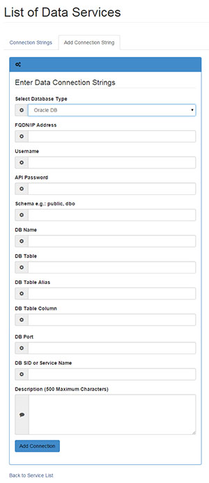			
		

  </section>    

  </li>
</ul>
  
  <!-- Tab Panel -->

<ul id = "tab-menu" class="tabs" data-tab role="tablist">
  <li class="tab-title active" role="presentational"><a href="#panel2-1" role="tab" tabindex="-1" aria-selected="true" controls="panel2-1">Overview</a></li>
  <li class="tab-title tab-title-feature" role="presentational"><a href="#panel2-2" role="tab" tabindex="-1" aria-selected="false" controls="panel2-2">Features</a></li>
  <li class="tab-title tab-title-requirement" role="presentational" id="#panel2-3" name="#panel2-3"><a href="#panel2-3" role="tab" tabindex="-1" aria-selected="false" controls="panel2-3">Requirements</a></li>
  <li class="tab-title tab-title-documentation" role="presentational"><a href="#panel2-4" role="tab" tabindex="-1" aria-selected="false" controls="panel2-4">Documentation</a></li>
</ul>

<!-- Overview -->
  <section role="tabpanel" aria-hidden="false" class="content active panel callout radius" id="panel2-1">
<ul class="large-block-grid-3">
  <li class= "text-center">
      
      <h3 class = "text-center"><strong>FREE</strong></h3>
      
Without any strings attached. It's   yours to try and use today!

  </li>
  <li class= "text-center">
      
      <h3 class= "text-center"><strong>SECURE</strong></h3>
      

      	Built with NIST standards in 
        mind. It's great for any federal, 
        state or local organization that  
        needs to share publicly available  
        data through an API.
		

  </li>
  <li class= "text-center">
      
      <h3 class= "text-center"><strong>SUPPORTED</strong></h3>
      
We regularly provide updates   and are here to help you.

  </li>
</ul>  
</section>
<!-- Features -->  
  <section role="tabpanel" data-options="deep_linking:true; scroll_to_content: true" aria-hidden="true" class="content panel feature radius " id="panel2-2">
    <h2>Database Support</h2>
	

	  
PostSQL - Version x or later

	  
DB2 - Version 5.2 or later

	  
Oracle - Version 9i or later

	

	

	  
MySQL - Version 4 or later

	  
MSSQL - Version 2010 or later

	  

	

    <h2><strong>Protect Your Data</strong></h2>
	

	  

 Delegation - Give access to local database administrators to control what data is shared 

	  

 Obfuscation - Make your table names human-friendly by hiding the technical details 

	
    
    <h2><strong>Ease of Use</strong></h2>
	

	  
For Administrators

	

	  
For Developers

	
 
	

	
Administrative interface with forms-based interface for managing:

		<ul>
			<li>Datasets</li>
			<li>API users</li>
			<li>Developer keys</li>
		</ul>
	

	

	  One stop shop for your organization's datasets 
	  One API key works across all of your datasets  
	  Software development kits for 8 languages & platforms
	

      
	     
  </section>
<!-- Requirements -->  

  <section role="tabpanel" aria-hidden="true" class="content panel requirement radius" data-options="deep_linking:true; scroll_to_content: true" id="panel2-3" name="panel2-3">
	

	  
<h3 id = "requirements">Basic Configuration</h3>

	
 
	

	  

	  
<strong>To run Quarry you’ll need:</strong>

       
A Debian based Linux distribution that has at least 5 GB of memory, two 2 gigabyte processors, and 20 gigabytes of free space.

        
Access to a MySQL or Microsoft SQL server.

        
Ability to download the <a href="
http://www.rackspace.com/knowledge_center/article/install-epel-and-additional-repositories-on-centos-and-red-hat
">REMI</a> and <a href=" 
http://www.rackspace.com/knowledge_center/article/install-epel-and-additional-repositories-on-centos-and-red-hat
">EPEL</a>  repositories.

  	
	   <a href="https://github.com/USDepartmentofLabor/Quarry" class="button"><strong>Download Quarry</strong></a>	    
	  

	  

	
 	
 </section>
<!-- Documentation -->  
  
  <section role="tabpanel" aria-hidden="true" data-options="deep_linking:true; scroll_to_content: true" class="content panel documentation radius" id="panel2-4">
		

			<!-- HIDE FOR NOW
			<ul>
				<li><a href="#Quarry_API_User_Manual">Quarry API User Manual</a></li>
				<li><a href="#Overview">Overview</a></li>
				<li><a href="#Product_Information">Product Information</a></li>
				<li><a href="#Product_Features">Product Features</a></li>
				<li><a href="#User_Types">User Types</a></li>
				<li><a href="#User_Type_Hierarchical_Details">User Type Hierarchical Details</a></li>
				<li><a href="#Super_Administrators">Super Administrators</a></li>
				<li><a href="#Application_Managers">Application Managers</a></li>
				<li><a href="#Developers">Developers</a></li>
				<li><a href="#Consumers">Consumers</a></li>
				<li><a href="#User_Management">User Management</a></li>
				<li><a href="#User_Lifecycle_Flow">User Lifecycle Flow</a></li>
				<li><a href="#User_Policies">User Policies</a></li>
				<li><a href="#Permissions">Permissions</a></li>
				<li><a href="#Roles">Roles</a></li>
				<li><a href="#Quarry_API_Key_Management">Quarry API Key Management</a></li>
				<li><a href="#Creating_Quarry_API_Keys">Creating Quarry API Keys</a></li>
				<li><a href="#Quarry_API_Keys">Quarry API Keys</a></li>
				<li><a href="#Dataset_Service_Managemen">Dataset Service Management</a></li>
				<li><a href="#Supported_Database_Types">Supported Database Types</a></li>
				<li><a href="#Typical_Configuration_Sequence_of_Quarry_API_Data_Service">Typical Configuration Sequence of Quarry API Data Service</a></li>
				<li><a href="#Add_Data_Service">Add Data Service</a></li>
			</ul>
			-->
			<h1 id="Quarry_API_User_Manual">Quarry API User Manual</h1>
			 
			<h2 id="Overview">Overview</h2>
			
This document is an operational overview of the administrative interface for Quarry API.  Details will be provided on how to manage and publish datasets.

			<h3 id = "Product_Information">Product Information</h3>
			
Quarry API is a convenient way to access DOL data and is designed using RESTful technology along with the user-friendly web 2.0 accessible layout. Therefore, the burden of data configuration, user management and RESTful API calls can be done with a less technically skilled staff.
			
			<h3 id="Product_Features">Product Features</h3>
			
With Quarry API you can:

			<ul>
				<li>Use any open web language to access data</li>
				<li>Obtain public datasets in JSON or XML formats</li>
				<li>Filter RESTful queries by key/pair parameters</li>
				<li>Run API CRUD (Create, Read, Update, and Delete) operations</li>
				<li>Conduct transactions via mobile device</li>
				<li>Add, edit, and delete users</li>
				<li>Add, edit, and delete user roles and permissions</li>
				<li>Add, edit, and delete Quarry API keys</li>
				<li>Add, edit, delete, and test data sources for DOL dataset retrieval</li>
			</ul>
			<h2 id="User_Types">User Types</h2>
			

				<table summary="Quarry API User Roles, which contains user type, definition, and technical proficiency fields">
					<caption>Quarry API User Roles</caption>
					<thead>
						<tr>
							<th scope="col">User Type</th>
							<th scope="col">Definition</th>
							<th scope="col">Technical Proficiency</th>
						</tr>
					</thead>
					<tbody>
						<tr>
							<th scope="row">Super Administrators (<b>Highest category</b>)</th>
							<td>Performs user and API management</td>
							<td>LOW</td>
						</tr>
						<tr>
							<th scope="row">Application Managers</th>
							<td>Manages how data is configured and propagated</td>
							<td>MID</td>
						</tr>
						<tr>
							<th scope="row">Developers</th>
							<td>Maintains the interface and writes applications</td>
							<td>HIGH</td>
						</tr>
						<tr>
							<th scope="row">Consumers</th>
							<td>End users</td>
							<td>LOW</td>
						</tr>
					</tbody>
				</table>
			

			

				<h3 id="Quarry_API_User_Roles">Quarry API User Roles</h3>
				

					
User Type: Super Administrators (<b>Highest category</b>)

					
Definition Performs user and API management

					
Technical Proficiency: LOW

				

				

					
User Type: Application Managers

					
Definition: Manages how data is configured and propagated

					
Technical Proficiency: MID

				

				

					
User Type: Developers

					
Definition Maintains the interface and writes applications

					
Technical Proficiency: HIGH

				

				

					
User Type: Consumers

					
Definition: End users

					
Technical Proficiency: LOW

				

			

			<h2 id="User_Type_Hierarchical_Details">User Type Hierarchical Details</h2>
			
This section describes how Quarry user types are defined and their contribution to the overall API data lifecycle.
			
			<h3 id="Super_Administrators">Super Administrators</h3>			
			
Administrators are the highest type of users in Quarry. They have access to all rights and features in the system. Their primary roles are to manage users, generate API keys for users, assign roles to all new users, and monitor the overall system health.

			<h3 id="Application_Managers">Application Managers</h3>
			
Users who only need to create datasets will be given this role. The application manager manages the data source&rsquo;s external system and will have the configuration details to create a connection for remote access to the necessary data. The application manager will need a valid API key to test a connection, along with test and examine the dataset prior to giving developers public access.

			<h3 id="Developers">Developers</h3>
			
Developers can be users who maintain Quarry API&rsquo;s codebase or are responsible for creating end user applications. Developers generally will use Quarry API to populate their applications.

			<h3 id="Consumers">Consumers</h3>
			
End users will be able to consume Quarry API data via handheld, tablet and desktop.

			<h2 id="User_Management">User Management</h2>
			<h3 id="User_Lifecycle_Flow">User Lifecycle Flow</h3>
			
All Quarry API users will need to register. Below is the Quarry API registration screen.

			
			<h4>Get Approved by an Administrator</h4>
			
An administrator will see your registration in the Pending Request page and will begin the approval process.

			<h5>Pending User Account Request List</h5>
			
			<h5>Approve Pending User Account Request</h5>
			
The pending page allows administrators to select your role and modify other information in your profile. This user has been given <b>Super Admin</b> rights.

			
			<h5>User Account Approval Message</h5>
						
			<h5>Login Screen</h5>
			
<b>Note</b>: Request Access feature has not been implemented as of v.1.0.0
			
						
			<h5>User Password Reset</h5>
			
			<h2 id="User_Policies">User Policies</h2>
			<h3 id="Permissions">Permissions</h3>
			
AdminUI is a permission-based interface which represents user driven features. All actions and operations are assigned to a permission in the source code. However, a permission must be created in the interface prior to the action being programmed in the source code. The Access Control List (ACL) governs permission&rsquo;s management in the AdminUI system. You can assign permissions to roles in the <b>Role Manager</b> page.

			<h4>Access Control List (ACL)</h4>			
			

				<table summary="Quarry Access Control List (ACL), which contains API permissions and description fields">
					<caption>Quarry Access Control List (ACL)</caption>
					<thead>
						<tr>
							<th scope="col">Quarry API Permissions</th>
							<th scope="col">Feature/Operation</th>
						</tr>
					</thead>
					<tbody>
						<tr>
							<td>Access ACL</td>
							<td>Allows access to view, and change settings in the ACL</td>
						</tr>
						<tr>
							<td>Add Datasets</td>
							<td>User can add datasets</td>
						</tr>
						<tr>
							<td>Add Key</td>
							<td>Generate new API keys</td>
						</tr>
						<tr>
							<td>Add Permissions</td>
							<td>Add permissions to the system</td>
						</tr>
						<tr>
							<td>Add Role</td>
							<td>Create new roles</td>
						</tr>
						<tr>
							<td>Add User</td>
							<td>Allows user to add roles to the system</td>
						</tr>
						<tr>
							<td>Assign Role</td>
							<td>Can assign roles to users</td>
						</tr>
						<tr>
							<td>Block Key</td>
							<td>Block API keys from interacting with Quarry</td>
						</tr>
						<tr>
							<td>Delete Dataset</td>
							<td>Delete datasets</td>
						</tr>
						<tr>
							<td>Delete Key</td>
							<td>Delete API keys</td>
						</tr>
						<tr>
							<td>Delete Permission</td>
							<td>Delete permissions from the system</td>
						</tr>
						<tr>
							<td>Delete Role</td>
							<td>Delete roles from the system</td>
						</tr>
						<tr>
							<td>Delete User</td>
							<td>Delete a user from the system</td>
						</tr>
						<tr>
							<td>Edit Datasets</td>
							<td>Edit datasets</td>
						</tr>
						<tr>
							<td>Edit Key</td>
							<td>Edit API key parameters </td>
						</tr>
						<tr>
							<td>Edit Permission</td>
							<td>Edit permission</td>
						</tr>
						<tr>
							<td>Edit Role</td>
							<td>Edit role properties</td>
						</tr>
						<tr>
							<td>Edit User</td>
							<td>Edit user profiles</td>
						</tr>
						<tr>
							<td>Modify Key Registration</td>
							<td>Edit registered API key</td>
						</tr>
						<tr>
							<td>Search Key</td>
							<td>Search API keys by properties</td>
						</tr>
						<tr>
							<td>Unblock Key</td>
							<td>Unblock an API key</td>
						</tr>
						<tr>
							<td>Validate Host</td>
							<td>Allowed to validate a data source connection</td>
						</tr>
						<tr>
							<td>View Datasets</td>
							<td>View datasets</td>
						</tr>
						<tr>
							<td>View Key</td>
							<td>View API keys</td>
						</tr>
						<tr>
							<td>View Permissions</td>
							<td>View permissions list</td>
						</tr>
						<tr>
							<td>View Rest Logs</td>
							<td>View REST transactions log</td>
						</tr>
						<tr>
							<td>View Roles</td>
							<td>View user role list</td>
						</tr>
						<tr>
							<td>View Users</td>
							<td>View user account list</td>
						</tr>
					</tbody>
				</table>
			
			
			

				<h5>Quarry Access Control List (ACL)</h5>
				

					
Quarry API Permissions: Access ACL

					
Feature/Operation: Allows access to view, and change settings in the ACL

				

				

					
Quarry API Permissions: Add Datasets

					
Feature/Operation: User can add datasets

				

				

					
Quarry API Permissions: Add Key

					
Feature/Operation: Generate new API keys

				

				

					
Quarry API Permissions: Add Permissions

					
Feature/Operation: Add permissions to the system

				

				

					
Quarry API Permissions: Add Role

					
Feature/Operation: Create new roles

				

				

					
Quarry API Permissions: Add User

					
Feature/Operation: Allows user to add roles to the system

				

				

					
Quarry API Permissions: Assign Role

					
Feature/Operation: Can assign roles to users

				

				

					
Quarry API Permissions: Block Key

					
Feature/Operation: Block API keys from interacting with Quarry

				

				

					
Quarry API Permissions: Delete Dataset

					
Feature/Operation: Delete datasets

				

				

					
Quarry API Permissions: Delete Key

					
Feature/Operation: Delete API keys

				

				

					
Quarry API Permissions: Delete Permission

					
Feature/Operation: Delete permissions from the system

				

				

					
Quarry API Permissions: Delete Role

					
Feature/Operation: Delete roles from the system

				

				

					
Quarry API Permissions: Delete User

					
Feature/Operation: Delete a user from the system

				

				

					
Quarry API Permissions: Edit Datasets

					
Feature/Operation: Edit datasets

				

				

					
Quarry API Permissions: Edit Key

					
Feature/Operation: Edit API key parameters

				

				

					
Quarry API Permissions: Edit Permission

					
Feature/Operation: Edit permission

				

				

					
Quarry API Permissions: Edit Role

					
Feature/Operation: Edit role properties

				

				

					
Quarry API Permissions: Edit User

					
Feature/Operation: Edit user profiles

				

				

					
Quarry API Permissions: Modify Key Registration

					
Feature/Operation: Edit registered API key

				

				

					
Quarry API Permissions: Search Key

					
Feature/Operation: Search API keys by properties

				

				

					
Quarry API Permissions: Unblock Key

					
Feature/Operation: Unblock an API key

				

				

					
Quarry API Permissions: Validate Host

					
Feature/Operation: Allowed to validate a data source connection

				

				

					
Quarry API Permissions: View Datasets

					
Feature/Operation: View datasets

				

				

					
Quarry API Permissions: View Key

					
Feature/Operation: View API keys

				

				

					
Quarry API Permissions: View Permissions

					
Feature/Operation: View permissions list

				

				

					
Quarry API Permissions: View Rest Logs

					
Feature/Operation: View REST transactions log

				

				

					
Quarry API Permissions: View Roles

					
Feature/Operation: View user role list

				

				

					
Quarry API Permissions: View Users

					
Feature/Operation: View user account list

				

			
			
			<h4>Adding Permissions</h4>
			
Adding permissions is a straightforward process. Please make sure you <b>do not</b> create duplicate system IDs or system names.

			

				<table summary="Quarry Permissions, which about property and definition fields">
					<caption>Quarry Permissions</caption>
					<thead>
						<tr>
							<th scope="col">Property</th>
							<th scope="col">Definition</th>
						</tr>
					</thead>
					<tbody>
						<tr>
							<td>System Name</td>
							<td>Human readable name for a permission</td>
						</tr>
						<tr>
							<td>System ID</td>
							<td>Slug name that is used in the source code</td>
						</tr>
						<tr>
							<td>Description</td>
							<td>Description of the permission</td>
						</tr>
					</tbody>
				</table>
			

			

				<h5>Quarry Permissions</h5>
				

					
Property: System Name

					
Definition: Human readable name for a permission

				

				

					
Property: System ID

					
Definition: Slug name that is used in the source code

				

				

					
Property: Description

					
Definition: Description of the permission

				

			

			
			<h3 id="Roles">Roles</h3>
			
All users must be assigned a role, which is a set of permissions that grants users access to AdminUI features.

			

				<table summary="Quarry Roles, which are the suer type and their permissions">
					<caption>Quarry Roles</caption>
					<thead>
						<tr>
							<th scope="col">User Type</th>
							<th scope="col">Rights</th>
						</tr>
					</thead>
					<tbody>
						<tr>
							<td>Super Administrators</td>
							<td>All permissions</td>
						</tr>
						<tr>
							<td>Application Managers</td>
							<td>Permissions only related to dataset management</td>
						</tr>
					</tbody>
				</table>
			

			

				<h4>Quarry Roles</h4>
				

					
User Type: Super Administrators

					
Rights: All permissions

				

				

					
User Type: Application Managers

					
Rights: Permissions only related to dataset management

				

			
			
			
			
You can create roles in the Account Manager menu. A role must be assigned at least one permission during its creation.  The table below describes the required role parameters.

			

				<table summary="List of User Roles, which a person can view, update, or delete">
					<caption>List of User Roles</caption>
					<thead>
						<tr>
							<th scope="col">Property</th>
							<th scope="col">Definition</th>
						</tr>
					</thead>
					<tbody>
						<tr>
							<td>System Name</td>
							<td>Human readable name</td>
						</tr>
						<tr>
							<td>System ID</td>
							<td>Slug name that is used in the source code</td>
						</tr>
						<tr>
							<td>Description</td>
							<td>Description of the role</td>
						</tr>
						<tr>
							<td>Permissions</td>
							<td>You can assign permissions in the UI</td>
						</tr>
					</tbody>
				</table>
			

			

				<h4>List of User Roles</h4>
				

					
Property: System Name

					
Definition: Human readable name

				

				

					
Property: System ID

					
Definition: Slug name that is used in the source code

				

				

					
Property: Description

					
Definition: Description of the role

				

				

					
Property: Permissions

					
Definition: You can assign permissions in the UI

				

			

			<h4>Creating Roles</h4>
			
Permissions will vary based on the user role, which you cannot have duplicate system IDs or system names.

			
			<h2 id="Quarry_API_Key_Management">Quarry API Key Management</h2>
			<h3 id="Creating_Quarry_API_Keys">Creating Quarry API Keys</h3>
			
Administrators can create new API keys by using the <b>Register New Key</b> tab found under the <b>API Key Manager</b> menu. Quarry API will accept APIv1 keys as well. A user can own multiple Quarry API keys. New API keys are emailed to the user.

			

				<table summary="Quarry API Key Information, which uses API key name, e-mail address, and description">
					<caption>OSHA Violation General Duty Standards</caption>
					<thead>
						<tr>
							<th scope="col">API Key Property</th>
							<th scope="col">Definition</th>
						</tr>
					</thead>
					<tbody>
						<tr>
							<td>API key name</td>
							<td>API label given by the user or organization</td>
						</tr>
						<tr>
							<td>Assigned E-mail Address</td>
							<td>User&rsquo;s email address</td>
						</tr>
						<tr>
							<td>Description</td>
							<td>API key description</td>
						</tr>
					</tbody>
				</table>
			

			

				<h4>Quarry API Key Information</h4>
				

					
API Key Property: API key name

					
Definition: API label given by the user or organization

				

				

					
API Key Property: Assigned E-mail Address

					
Definition: User&rsquo;s email address

				

				

					
API Key Property: Description

					
Definition: API key description

				

			
			
			
			<h3 id="Quarry_API_Keys">Quarry API Keys</h3>
			
The <b>API Key Manager</b> contains a list of API keys. In addition to deleting keys, administrators can block/unblock user keys should the need arises, along with additional features available on this page.

			
			<h2 id="Dataset_Service_Managemen">Dataset Service Management</h2>
			
The <b>Manage Datasets</b> menu allows administrators to configure datasets for the Quarry API REST engine. The definitions in table 6.1 are the main components for the dataset management service.  The connection string parameters are supplied by the data source owner.

			
Be mindful that Quarry API v1.0.0 currently supports four database types. 

			<h3 id="Supported_Database_Types">Supported Database Types:</h3>
			<ul>
				<li>MySQL</li>
				<li>Microsoft SQL</li>
				<li>Oracle</li>
				<li>PostgreSQL</li>
			</ul>
			

				<table summary="Quarry Database Query Information, which uses connection string, dat source, dataset, obfuscation, and service to extract information">
					<caption>Quarry Database Query Information</caption>
					<thead>
						<tr>
							<th scope="col">Quarry Data service</th>
							<th scope="col">Definition</th>
						</tr>
					</thead>
					<tbody>
						<tr>
							<td>Connection string</td>
							<td>Connection strings are input parameters that allow Quarry to connect to a remote data source</td>
						</tr>
						<tr>
							<td>Data source</td>
							<td>Remote data resource that will be RESTfully accessed by Quarry API</td>
						</tr>
						<tr>
							<td>Dataset</td>
							<td>RESTful data structure based on a user&rsquo;s input</td>
						</tr>
						<tr>
							<td>Obfuscation</td>
							<td>Technique of obscuring the data source&rsquo;s table names for security purposes</td>
						</tr>
						<tr>
							<td>Service</td>
							<td>Quarry provides round trip user input translation services from HTTP to SQL as outlined in list 6.1 Using advance technology lessens the technical learning curve while enhancing the user experience</td>
						</tr>
					</tbody>
				</table>
			

			

				<h4>Quarry Database Query Information</h4>
				

					
Quarry Data service: Connection string

					
Definition: Connection strings are input parameters that allow Quarry to connect to a remote data source

				

				

					
Quarry Data service: Data source

					
Definition: Remote data resource that will be RESTfully accessed by Quarry API

				

				

					
Quarry Data service: Dataset

					
Definition: RESTful data structure based on a user&rsquo;s input

				

				

					
Quarry Data service: Obfuscation

					
Definition:  	Technique of obscuring the data source&rsquo;s table names for security purposes

				

				

					
Quarry Data service: Service

					
Definition: Quarry provides round trip user input translation services from HTTP to SQL   as outlined in list 6.1 Using advance technology lessens the technical learning curve while enhancing the user experience

				

			
			
			<h3 id="Typical_Configuration_Sequence_of_Quarry_API_Data_Service">Typical Configuration Sequence of Quarry API Data Service</h3>
			<ol>
				<li>The application manager will contact the data source owner for the connection string information.</li>
				<li>The application manager will request that the data source owner provides an obfuscated  list of available table names.</li>
				<li>The application manager will add a dataset by selecting the appropriate database type and entering the connection string parameters including the obfuscated table name information.</li>
				<li>Test the new connection string   for datasets using Quarry&rsquo;s AdminUI. You can see the datasets information in either JSON or XML format, dependent on your choice.</li>
				<li>If you   are able to successfully connect to a data source, but cannot retrieve data, contact the data source owner and check if the remote configuration is working or whether the database has data.</li>
			</ol>
			<h3 id="Add_Data_Service">Add Data Service</h3>
			
Obtain connection string parameters from the data source owner.  Use table 6.2 as a reference. If the owner does not have the database type listed, Quarry API cannot offer service. Please note which fields in this table are required, optional or not applicable depending on the database type (MySQL, Microsoft SQL, Oracle and PostgreSQL).

			

				<table summary="Quarry Database Fields, which include FQDN/IP Address, user name, password, database name, schema, table name, and a few more">
					<caption>Quarry Database Fields</caption>
					<thead>
						<tr>
							<th scope="col">Database Parameters</th>
							<th scope="col">MySQL</th>
							<th scope="col">Microsoft SQL</th>
							<th scope="col">Oracle</th>
							<th scope="col">PostgreSQL</th>
						</tr>
					</thead>
					<tbody>
						<tr>
							<th scope="row">FQDN/IP Address</th>
							<td>Required</td>
							<td>Required</td>
							<td>Required</td>
							<td>Required</td>
						</tr>
						<tr>
							<th scope="row">API Username</th>
							<td>Required</td>
							<td>Required</td>
							<td>Required</td>
							<td>Required</td>
						</tr>
						<tr>
							<th scope="row">API Password</th>
							<td>Required</td>
							<td>Required</td>
							<td>Required</td>
							<td>Required</td>
						</tr>
						<tr>
							<th scope="row">DB Name</th>
							<td>Required</td>
							<td>Required</td>
							<td>Required</td>
							<td>Required</td>
						</tr>
						<tr>
							<th scope="row">Instance</th>
							<td>N/A</td>
							<td>Optional</td>
							<td>N/A</td>
							<td>N/A</td>
						</tr>
						<tr>
							<th scope="row">Schema</th>
							<td>N/A</td>
							<td>Required</td>
							<td>Required</td>
							<td>Required</td>
						</tr>
						<tr>
							<th scope="row">Table Name</th>
							<td>Required</td>
							<td>Required</td>
							<td>Required</td>
							<td>Required</td>
						</tr>
						<tr>
							<th scope="row">Alias</th>
							<td>Required</td>
							<td>Required</td>
							<td>Required</td>
							<td>Required</td>
						</tr>
						<tr>
							<th scope="row">Column Name</th>
							<td>Optional</td>
							<td>Optional</td>
							<td>Optional</td>
							<td>Optional</td>
						</tr>
						<tr>
							<th scope="row">SID or Service Name</th>
							<td>N/A</td>
							<td>N/A</td>
							<td>Optional</td>
							<td>N/A</td>
						</tr>
						<tr>
							<th scope="row">Port</th>
							<td>Optional</td>
							<td>Optional</td>
							<td>Optional</td>
							<td>Optional</td>
						</tr>
						<tr>
							<th scope="row">Description</th>
							<td>Required</td>
							<td>Required</td>
							<td>Required</td>
							<td>Required</td>
						</tr>
					</tbody>
				</table>
			

			

				<h4>Quarry Database Fields</h4>
				

					
Database Parameters: FQDN/IP Address

					
MySQL: Required

					
Microsoft SQL: Required

					
Oracle: Required

					
PostgreSQL: Required

				

				

					
Database Parameters: API Username

					
MySQL: Required

					
Microsoft SQL: Required

					
Oracle: Required

					
PostgreSQL: Required

				

				

					
Database Parameters: API Password

					
MySQL: Required

					
Microsoft SQL: Required

					
Oracle: Required

					
PostgreSQL: Required

				

				

					
Database Parameters: DB Name

					
MySQL: Required

					
Microsoft SQL: Required

					
Oracle: Required

					
PostgreSQL: Required

				

				

					
Database Parameters: Instance

					
MySQL: N/A

					
Microsoft SQL: Optional

					
Oracle: N/A

					
PostgreSQL: N/A

				

				

					
Database Parameters: Schema

					
MySQL: N/A

					
Microsoft SQL: Required

					
Oracle: Required

					
PostgreSQL: Required

				

				

					
Database Parameters: Table Name

					
MySQL: Required

					
Microsoft SQL: Required

					
Oracle: Required

					
PostgreSQL: Required

				

				

					
Database Parameters: Alias

					
MySQL: Required

					
Microsoft SQL: Required

					
Oracle: Required

					
PostgreSQL: Required

				

				

					
Database Parameters: Column Name

					
MySQL: Optional

					
Microsoft SQL: Optional

					
Oracle: Optional

					
PostgreSQL: Optional

				

				

					
Database Parameters: SID or Service Name

					
MySQL: N/A

					
Microsoft SQL: N/A

					
Oracle: Optional

					
PostgreSQL: N/A

				

				

					
Database Parameters: Port

					
MySQL: Optional

					
Microsoft SQL: Optional

					
Oracle: Optional

					
PostgreSQL: Optional

				

				

					
Database Parameters: Description

					
MySQL: Required

					
Microsoft SQL: Required

					
Oracle: Required

					
PostgreSQL: Required

				

			

			
Figure 6.1 shows how to connect to an Oracle data source to Quarry. Please use table 6.1 as a guide to which fields are necessary.
			
						
		

  </section>
  

